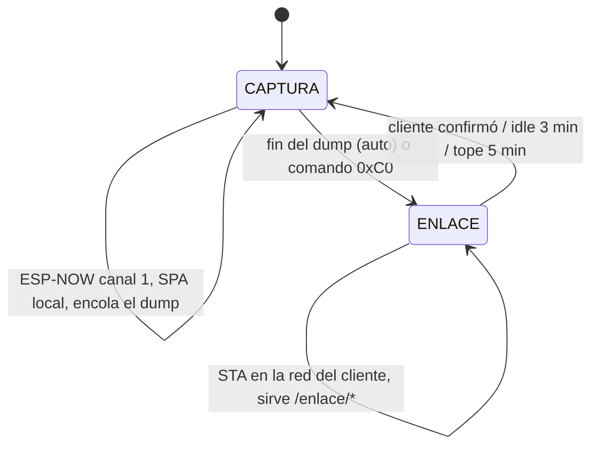

# Plan: modo ENLACE del maestro + server de datos

Estado: **firmware implementado y compilando, sin probar en hardware**. El lado
server está en diseño. Este documento reemplaza la versión anterior del plan,
que asumía que el maestro subía los datos por sí mismo (ver "Decisiones que
cambiaron", al final).

## Motivación

El flujo de campo histórico es: el maestro ESP32 levanta un AP local
(`GeoNetwork`, `192.168.4.1`) sin salida a internet, el operador se conecta con
el celular, revisa la captura en la SPA, y al final descarga un ZIP armado 100%
en el navegador (`data/js/zip_store.js` + `export.js`). Ese ZIP se descomprime a
mano en una carpeta que después lee `review_field_data.py`.

Dos problemas:

1. Mientras el celular está conectado al AP del maestro, Android le corta (o
   desprioriza) los datos móviles, porque asume que una red WiFi debe tener
   salida a internet. Eso bloquea cualquier sync automático.
2. El maestro no persiste nada: los datos se espejan en vivo por WebSocket y el
   navegador los acumula en `data_store.js`. **Si no hay un navegador escuchando
   en el momento de la captura, el dato no existe en ningún lado.**

## Arquitectura acordada

```
PSoC ──interfaz física──> ESP slave ──ESP-NOW ch1──> ESP master (AP + SPA)
                                                            │ interfaz web
                                                            ▼
                                          Cliente adquisidor (celular/tablet/PC)
                                                            │ túnel (Tailscale)
                                                            ▼
                                                    Server de datos (docker)
                                                            │ interfaz web
                                                            ▼
                                                     Cliente analista
```

Cada eslabón hace una sola cosa:

- **ESP master**: captura, encola y sirve. **Nunca sale a internet.**
- **Cliente adquisidor**: el único que atraviesa el túnel. Puede ser el celular
  del operador o un equipo fijo dejado junto al maestro (tablet, mini PC) para
  las sesiones desatendidas — si el maestro tiene internet cerca es porque hay
  un cliente cerca.
- **Server de datos**: un solo contenedor Docker, por portabilidad. Recibe,
  almacena, procesa y sirve la interfaz web del analista.
- **Cliente analista**: solo un navegador contra el túnel. Sin instalar nada,
  sin descargar datasets, sin mover carpetas.

### Por qué el maestro no atraviesa el túnel

El ESP32 no puede correr Tailscale (es un binario Go para sistemas operativos
completos). Para que hablara con el server habría que exponerlo público con
Tailscale Funnel + token, con TLS en el firmware. El cliente adquisidor, en
cambio, ya corre Tailscale nativo. Sacar esa responsabilidad del ESP:

- elimina TLS, tokens y URLs del firmware (**Flash 82.2% → 69.8%**);
- deja al server escuchando **solo en la tailnet**, sin nada expuesto a internet.

## Fase CAPTURA / fase ENLACE (multiplexación temporal)

El maestro nunca está en las dos redes a la vez:

- **`CAPTURA`**: modo histórico sin cambios — `WIFI_AP_STA`, AP propio en canal
  1, ESP-NOW con los esclavos, SPA local.
- **`ENLACE`**: baja el AP, apaga ESP-NOW y se asocia como STA al hotspot del
  cliente (o a un router). Ahí **sigue sirviendo la SPA** y además expone la
  cola. El celular conserva sus datos móviles y al mismo tiempo alcanza al
  maestro por IP.



Es seguro porque el protocolo con los esclavos es **maestro-iniciado** (los
esclavos esperan pasivos, no hacen polling ni retransmiten solos) y **no
escanean canales**: tienen hardcodeado `esp_wifi_set_channel(1, ...)` en
`slave/src/main.cpp:3062`. Apenas el AP vuelve a canal 1, ESP-NOW retoma sin
negociación. La regla dura es **no cambiar de fase a mitad de una captura**:
`requestEnlace()` solo acepta desde `IDLE`/`ARMED`.

## Estado: firmware (implementado)

`src/firmware/esp32/Nodo comunicación/master/`

- **`src/link_mode.h`** (nuevo): config persistida, cola en LittleFS, runner de
  la fase ENLACE.
- **`src/main.cpp`**: estado `ENLACE`, tee del dump hacia la cola,
  `radioTearDownCapture()` / `radioBringUpCapture()`, comando `0xC0`
  (`param=1` subir ahora; `param=0` + `value` prende/apaga el auto).
- **`src/web_server.h`**: endpoints `/enlace/*`.

### La cola resuelve el buffering

Durante `DUMPING`, cada lote se escribe además a `/q/NNNN.geoq` en LittleFS. El
dato deja de depender de que haya un navegador conectado: el cliente puede
llegar **después** de la captura y llevarse la sesión entera.

Presupuesto: la partición son 1.4 MB y la SPA ocupa ~296 KB. El módulo reserva
96 KB libres (para no dejar sin servir a la SPA) y verifica antes de abrir que
la sesión entre. Si no entra, no encola y la captura sigue normal hacia el WS.

Formato `.geoq`: cabecera + tabla de nodos + lotes crudos (3 bytes por muestra,
tal como llegan por ESP-NOW). La tabla lleva rol GEO/HAMMER, fs real del PSoC,
largo por nodo y MAC — es lo que le permite al server armar el `metadata.json`
sin que haya habido un navegador. Especificación completa en el encabezado de
`link_mode.h`.

### Endpoints

| Endpoint | Uso |
|---|---|
| `GET /enlace/status` | fase, IP, cola pendiente, espacio libre, último error |
| `POST /enlace/config` | `ssid`, `pass`, `site`, `distance_mm`, `auto` |
| `GET /enlace/queue` | lista `<nombre> <bytes>` por línea |
| `GET /enlace/file?name=` | descarga un `.geoq` |
| `POST /enlace/ack?name=` | el cliente confirma que ya está en el server → borra |
| `POST /enlace/done` | volver a CAPTURA sin esperar el idle |

El borrado va contra **ACK explícito**, no contra la descarga: la cola es la
copia buena hasta que alguien diga que el dato ya está a salvo en el server.

## Pendiente: server de datos

Decidido: **un solo contenedor Docker**, corriendo por ahora en la PC del
usuario con Tailscale. Diseñado para que dé igual dónde corra (volumen externo,
config por variables de entorno), así mudarlo después es mover un volumen.

Orden de trabajo acordado: **primero Python, después dockerizar** — dockerizar
algo que ya anda es media hora.

Alcance del contenedor:

1. **Ingesta**: recibe los `.geoq` del cliente adquisidor y los decodifica.
2. **Almacenamiento**: escribe el layout que ya consume `discover_dataset`
   (`field_review_data.py:184`), para no reescribir la lógica de descubrimiento.
3. **Procesamiento**: MASW e inversión. Tarda minutos, así que va por **jobs en
   background**, no request/response.
4. **Interfaz web del analista**: reemplaza a `field_review_app.py` (PyQt5,
   ~6000 líneas). La app de escritorio se retira cuando la web llegue a paridad,
   no antes.

Puntos abiertos:

- El `.geoq` todavía no transporta la config de ADC por nodo, así que la
  conversión cuentas→volts asume ±2.5 V (`ADC_CONFIGS[0]`, 131072/2.5 cuentas
  por volt, igual que la SPA por defecto). Si se usa otro rango hay que agregar
  el campo a la tabla de nodos.
- El maestro no tiene RTC: el `.geoq` viaja con `epoch_s = 0` y la marca de
  tiempo real la pone quien lo recibe.
- `filt_f32le.bin` lo calcula hoy el navegador (FIR sobre la captura completa).
  El server tendrá que hacerlo, o el dataset queda solo con `raw`
  (`_discover_channels` acepta cualquiera de los dos).

## Qué NO cambia

- La ruta manual de exportar el ZIP desde la SPA sigue existiendo tal cual.
- El protocolo maestro↔esclavos (ESP-NOW) y maestro↔MATLAB (USB) no se tocan.
- El layout de carpetas de los datasets, que es la fuente de verdad.

## Cómo probarlo en hardware

1. `pio run -t upload` y `pio run -t uploadfs` en `master/`.
2. Configurar el enlace (desde la SPA, sobre el AP):
   `POST /enlace/config` con `ssid`, `pass` del hotspot, `site` y `distance_mm`.
3. Capturar normal. Al terminar el dump, `GET /enlace/status` debe mostrar
   `queue_files=1`.
4. Disparar ENLACE (comando `0xC0` con `param=1`, o `auto=1` para que se
   dispare solo al terminar cada dump).
5. Con el celular en su propio hotspot: `GET /enlace/status` contra la IP nueva
   del ESP, bajar de `/enlace/queue` y `/enlace/file`, y confirmar con
   `/enlace/ack`.
6. Verificar que al volver a CAPTURA el ESP-NOW retoma: los esclavos deben
   responder sin reset.

## Decisiones que cambiaron respecto del plan original

- **El maestro ya no sube nada.** Se descartó Tailscale Funnel + POST desde el
  ESP: el cliente adquisidor atraviesa el túnel.
- **Se descartó Google Drive como destino.** Con el server conservando los datos
  y el analista entrando por web, Drive queda como backup opcional, no como
  parte del camino del dato.
- **`review_field_data.py` deja de ser el destino final.** Sigue funcionando
  sobre el volumen, pero la interfaz que se va a usar es la web del contenedor.
- Se mantiene lo validado: la multiplexación temporal, el canal 1 fijo de los
  esclavos y la regla de no cambiar de fase a mitad de captura.
